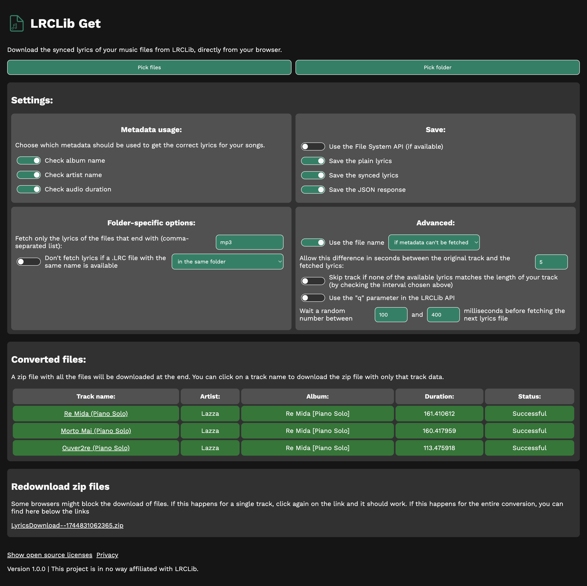

# LRCLib Get

A simple website that is able to download synced and plain lyrics of your local
songs from LRCLib.

Try it: https://dinoosauro.github.io/lrclib-get/

## Usage

Open the website. You'll immediately find the Settings, where you can customize
the parameters that'll be used to match your songs with the LRCLib database.

After you've done this, pick the files by clicking the "Pick files" button
above.

If you want to download the lyrics of an entire folder, you can use the "Pick
folder" button. If your browser supports it, and if you've enabled it from the
Settings, the website can directly write the lyrics on your device using the
File System API. In this case, files will be written in the same folder of the
audio file. Otherwise, a zip file will be created.

The website will automatically fetch the data and download it. You can click on
the name of a single track to download the zip file with all the fetched data
about that track (JSON response, plain lyrics and synced lyrics).

## Privacy

This website connects to the LRCLib API to fetch lyrics. We share with them only
the information about the audio track, and you're able to choose which fields
should be sent. We'll also send this website's name and this website's version.
By using this tool, you also agree to their Terms of Service and Privacy Policy.

This website also connects to Google Fonts to display the fonts used in this
webpage, and to JSDelivr to fetch the "jsmediatags" library. No data is shared
with them. Other third-party libraries are used, and you can find their license
in the "Open source licenses" section of the website.
